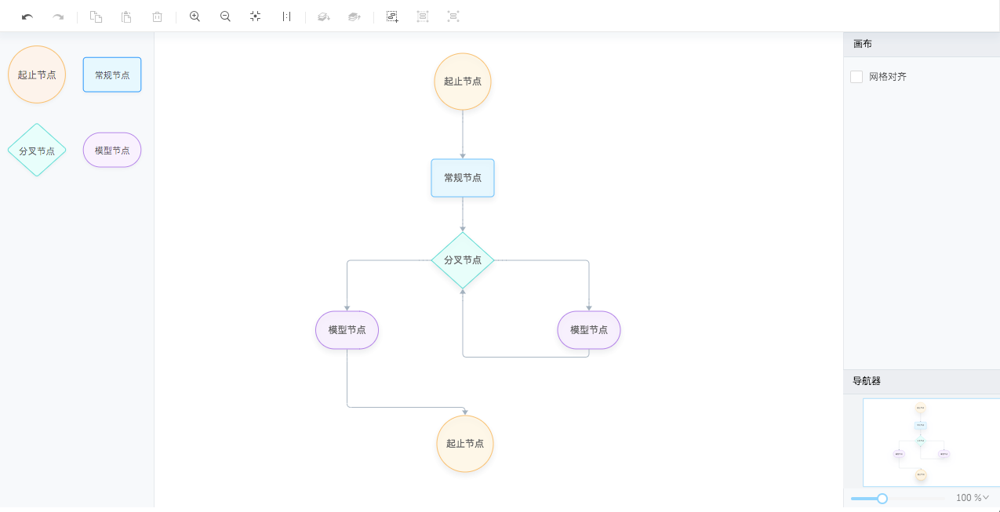
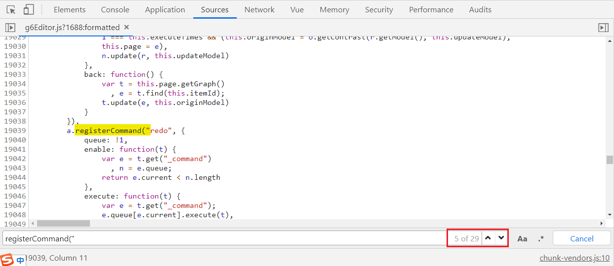

# 阅读建议

由于本文档目录太多，建议安装Chrome插件 [Smart TOC](https://chrome.google.com/webstore/detail/smart-toc/lifgeihcfpkmmlfjbailfpfhbahhibba)，可清晰一览文档层次结构，同时也方便按目录跳转查看。

因本人仍在开发及探索中，目前此文档的层级结构尚未确定，只能是碰到什么便整理总结什么。

Github：https://github.com/blueju/vue-g6-editor


# g6-editor 能做什么

g6-editor 作为图编辑器，根据官方文档提供的DEMO，主要能做以下三类图：

> 但在实际使用中，对所提供 API 的了解，似乎又不仅能做以下三类图，还可做网络图/拓扑图

1. 基础流程图

   

2. 模型流程图

   

3. 思维导图（脑图）

   


# HTML

该目录主要整理 g6-editor 在HTML层面的术语解释、使用规范、示例和注意点。

## 工具栏

工具栏负责盛放一个操作按钮，类似 wangEditor 中顶部的操作工具按钮区域。

g6-editor 已经为我们做好了许多工作，我们只需要按规范写好HTML标签，然后给它们配上合适的图标和标题。

### 规范

- 必须拥有 data-command 属性，并设置需要的命令，详见本文中内置命令列表。
- class 中必须拥有 command。

### 示例

> 我使用的图标是 font-awesome

```html
<div id="toolbar">
  <i data-command="save" class="command fa fa-floppy-o" title="保存"></i>
  <i data-command="undo" class="command fa fa-undo" title="撤销"></i>
  <i data-command="redo" class="command fa fa-repeat" title="重做"></i>
  <i data-command="delete" class="command fa fa-trash-o" title="删除"></i>
  <i data-command="zoomOut" class="command fa fa-search-minus" title="缩小"></i>
  <i data-command="zoomIn" class="command fa fa-search-plus" title="放大"></i>
  <i data-command="clear" class="command fa fa-eraser" title="清除画布"></i>
  <i data-command="toFront" class="command fa fa-arrow-up" title="提升层级"></i>
  <i data-command="toBack" class="command fa fa-arrow-down" title="下降层级"></i>
  <i data-command="selectAll" class="command fa fa-check-square-o" title="全选"></i>
  <i data-command="copy" class="command fa fa-files-o" title="复制"></i>
  <i data-command="paste" class="command fa fa-clipboard" title="粘贴"></i>
  <i data-command="autoZoom" class="command fa fa-expand" title="实际大小"></i>
  <i data-command="resetZoom" class="command fa fa-compress" title="适应页面"></i>
  <i data-command="addGroup" class="command fa fa-object-group" title="组合"></i>
  <i data-command="unGroup" class="command fa fa-object-ungroup" title="取消组合"></i>
  ....
</div>
```

## 元素面板

元素面板负责盛放一些可拖拽的元素，供使用人员拖拽到画板中。

### 元素

元素仅仅是一个定义了一些属性和 class 的HTML标签，为了给予美观的效果，我一般会往元素标签中添加图片。

g6-editor的官方文档中，并未提及元素图片，结合搜索引擎，我也仅搜索四种元素图片，格式为svg。

如果你想自己自定义的元素图片，建议使用svg。

| 名称     | 地址                                                         |
| -------- | ------------------------------------------------------------ |
| 起止节点 | https://gw.alipayobjects.com/zos/rmsportal/ZnPxbVjKYADMYxkTQXRi.svg |
| 常规节点 | https://gw.alipayobjects.com/zos/rmsportal/wHcJakkCXDrUUlNkNzSy.svg |
| 分叉节点 | https://gw.alipayobjects.com/zos/rmsportal/SnWIktArriZRWdGCnGfK.svg |
| 模型节点 | https://gw.alipayobjects.com/zos/rmsportal/rQMUhHHSqwYsPwjXxcfP.svg |

### 示例

```html
<div id="itempannel">
  <div
    class="getItem"
    data-type="node"
    data-shape="flow-rect"
    data-size="120*48"
    data-label="常规节点"
    data-color="#1890FF"
  >
    
  </div>
  <div
    class="getItem"
    data-type="node"
    data-shape="flow-circle"
    data-size="72*72"
    data-label="起止节点"
    data-color="#FA8C16"
  >
    
  </div>
  <div
    class="getItem"
    data-type="node"
    data-shape="flow-rhombus"
    data-size="80*72"
    data-label="分叉节点"
    data-color="#13C2C2"
  >
    
  </div>
  <div
    class="getItem"
    data-type="node"
    data-shape="flow-capsule"
    data-size="80*48"
    data-label="模型节点"
    data-color="#722ED1"
  >
    
  </div>
</div>
```

### 注意点

#### class 名称

以上示例中的 class 名称（getItem），不可删除，不可用其他 class 替换，否则会出现无法将元素拖拽入画板的问题。

#### data-* 属性

元素标签中，所有带有 * 属性都会被添加进节点的数据模型，data-type除外，因为它是g6-editor设定的保留字段，决定了元素类型，如果你取值为node，则拖出的是节点。

data-size的写法特殊，是长×宽的方式，详见以上示例，data-size的大小决定了其被拖入画布后的大小。

以上示例中 HTML代码 和 data-* 属性，已是本人在保证语义化和无bug出现情况下的最精简版本，可直接复制使用。

熟悉G6的同学可能秒懂，但如果不清楚什么意思也没关系，后续操作中你就会发现其联系。

#### img

元素图片必须设置为禁止拖拽，draggable="false"，否则拖拽到画板后，需要二次点击才会取消元素选中状态。

## 画布

### 示例

```html
<div id="page"></div>
```

### 注意

#### id

画布标签的 id 必须为 page，否则控制台会报错，原因不明，错误如下：


#### 高度

必须在CSS中为画布设定高度

## 属性栏

属性栏一般在画布右侧，用于设置节点/边/画布等属性，类似这种：


### 思路

我初次看 g6-editor 文档的示例DEMO时，看到属性栏的HTML标签中含有 data-status="node-selected" 等属性，以为，但是在后续的操作，并未发现 data-status="*" 的属性的作用，也可能是我暂时没有发现。

我在实践中感觉这里 g6-editor 并没有为我们提供什么现成的东西，更多是只是我们需要在右侧这一块区域，创建一些表单，在进行一些操作时（比如选中一个节点），通过API获取数据并填充到表单中，以此来展示所选元素的属性。

### 示例

```html
<div id="detailpannel">
  <!-- 节点属性栏 -->
  <div id="nodeAttributeBar" data-status="node-selected">
    <div class="title">节点属性</div>
    <div class="main">
      <el-form :model="nodeAttributeForm" label-position="top" label-width="80px">
        <el-form-item label="节点文本">
          <el-input v-model="nodeAttributeForm.label" @change="saveNodeAttribute"></el-input>
        </el-form-item>
        <el-form-item label="宽度">
          <el-input v-model="nodeAttributeForm.width" @change="saveNodeAttribute"></el-input>
        </el-form-item>
        <el-form-item label="高度">
          <el-input v-model="nodeAttributeForm.height" @change="saveNodeAttribute"></el-input>
        </el-form-item>
        <el-form-item label="颜色">
          <el-color-picker v-model="nodeAttributeForm.color" @change="saveNodeAttribute"></el-color-picker>
        </el-form-item>
      </el-form>
    </div>
  </div>
  <!-- 边属性栏 -->
  <div id="edgeAttributeBar" data-status="edge-selected">
    <div class="title">边属性</div>
    <div class="main">
      <el-form :model="edgeAttributeForm" label-position="top" label-width="80px">
        <el-form-item label="边文本">
          <el-input v-model="edgeAttributeForm.label" @change="saveEdgeAttribute"></el-input>
        </el-form-item>
        <el-form-item label="边文本">
          <el-select v-model="edgeAttributeForm.shape" @change="saveEdgeAttribute">
            <el-option label="流程图折线" value="flow-polyline"></el-option>
            <el-option label="流程图圆⻆折线" value="flow-polyline-round"></el-option>
            <el-option label="流程图曲线" value="flow-smooth"></el-option>
          </el-select>
        </el-form-item>
      </el-form>
    </div>
  </div>
</div>
```

### 官方文档示例对比

> 未免也太简陋了。。。

```html
<div id="detailpannel">
	<div data-status="node-selected">节点属性栏</div>
	<div data-status="edge-selected">边属性栏</div>
	<div data-status="group-selected">群组属性栏</div>
	<div data-status="canvas-selected">画布属性栏</div>
	<div data-status="multi-selected">多选时属性栏</div>
</div>
```

## 缩略图

HTML层面仅以下代码即可，JS层面 g6-editor 会自动往其中填入我们所需的缩略图。

```html
<div id="minimap"></div>
```

## 右键菜单

HTML层面仅以下代码即可，我们仅需要再加点样式使其美观即可。JS层面 g6-editor 会自动在不同状态下控制它们的显示隐藏状态。

### 示例

```html
<div id="contextmenu">
  <div data-status="node-selected" class="menu">
    <button data-command="copy" class="command">复制</button>
    <button data-command="paste" class="command">粘贴</button>
    <button data-command="delete" class="command">删除</button>
  </div>
  <div data-status="edge-selected" class="menu">
    <button data-command="delete" class="command">删除</button>
  </div>
  <div data-status="group-selected" class="menu">
    <button data-command="copy" class="command">复制</button>
    <button data-command="paste" class="command">粘贴</button>
    <button data-command="unGroup" class="command">取消组合</button>
    <button data-command="delete" class="command">删除</button>
  </div>
  <div data-status="canvas-selected" class="menu">
    <button data-command="undo" class="command">撤销</button>
    <button data-command="redo" class="command disable">重做</button>
  </div>
  <div data-status="multi-selected" class="menu">
    <button data-command="copy" class="command">复制</button>
    <button data-command="paste" class="command">粘贴</button>
    <button data-command="addGroup" class="command">组合</button>
  </div>
</div>
```

### 注意

- 状态改变对应的事件是 statuschange，如果你绑定了 statuschange 事件，你可以在控制台中打印查看当前是什么状态。

- 以下示例代码已是最简，建议直接复用，data-status="<u>status</u>"、class="menu" 和 class="command" 均不可删除，否则会出现问题。
- 右键菜单一般只有在我们点击右键的时候才出现，但 g6-editor 默认右键菜单一开始就是显示的，这就显得非常不合理。因此我们需要手动在CSS中先给它设置一个 display:none，对右键菜单进行隐藏。


# JavaScript

该目录主要整理 g6-editor 在 JS 层面的术语解释、使用规范、示例和注意点。

## 关闭体验改进计划打点请求

为了更好服务⽤户，G6Editor 会将 URL 和版本信息发送回 AntV 服务器，除了 URL 与 G6 版本信息外，不会收集任何其他信息。

如有担⼼，可以通过下⾯的代码关闭： 

```javascript
G6Editor.track(false)
```

## 组件

### 右键菜单

右键菜单类，负责处理右键菜单的显示隐藏、命令绑定、可⽤禁⽤状态控制。


### 缩略图

缩略图类，负责绘制缩略图及双图联动。

#### 初始化

```javascript
const minimap = new G6Editor.Minimap({
	// 配置项
	container: "minimap",
	width: 320,
	height: 200
    ...
})
```

#### 配置项

- container

  > 必填		object / string
  >
  > 缩略图HTML标签的DOM对象或者ID

- width

  > 必填		number
  >
  > 宽度

- height

  > 必填		number
  >
  > 高度

- viewportWindowStyle

  > 选填		object
  >
  > 缩略图可视区域视窗样式
  >
  > 参考 [G/G2 绘图属性](https://g2.antv.vision/zh/docs/manual/shape-attrs#gatsby-focus-wrapper)（官方文档中的链接已经404，这是我根据一些关键词找到，属性应该对的上）

- viewportBackStyle

  > 选填		object
  >
  > 缩略图可视区域视窗样式
  >
  > 参考 [G/G2 绘图属性](https://g2.antv.vision/zh/docs/manual/shape-attrs#gatsby-focus-wrapper)（官方文档中的链接已经404，这是我根据一些关键词找到，属性应该对的上）


## Editor 编辑器

该类是整个 g6-editor 的主控类，其主要职责是将 g6-editor 的各个组件协同起来。（摘自官方文档并做了微调）

> 至于为什么说是类，可能他们是用 ES6 语法 class 实现的吧。

### 实例化

使用需要实例化

```javascript
import G6Editor from "@antv/g6-editor";
const editor = new G6Editor();
...
```

### 方法列表

> 可打印实例化后 editor，通过查看上一层原型链的方式查看更多方法。
>
> 除下表方法以外，还有一些方法，但均以 _ 开头，可能为私有方法用得少，下表不再列举，想看的可在控制台自行查看。

| 方法                | 名称       | 备注                                                      |
| ------------------- | ---------- | --------------------------------------------------------- |
| add                 | 添加组件   |                                                           |
| commandEnable       |            |                                                           |
| destroy             | 销毁编辑器 |                                                           |
| executeCommand      | 执行命令   | 通过此方法执行的操作，均会进入队列，可撤销/重做，建议使用 |
| getCommands         |            |                                                           |
| getComponents       |            |                                                           |
| getComponentsByType |            |                                                           |
| getCurrentCommand   |            |                                                           |
| getCurrentPage      |            |                                                           |
| getDefaultCfg       |            |                                                           |
| setCommandDOMenable |            |                                                           |


## Page 页面

page 不需要独立去实例化之类的设置，从使用上来，可以说和 editor 是一体的，实例化完editor 就有 page了，就可以通过 js 获取 page了。

```
let page = editor.getCurrentPage()
```


## Flow 流程图

### 简介

流程图页面类，专用于构建有向的流程图编辑器。

继承自 Page，因此在实例化完 editor 后，我们就可以通过 js 获取 Flow 了。

```javascript
editor.getCurrentPage().getGraph({
  graph: {
    container: "page",
    // ...
  },
  align: {
    // ...
  },
  grid: {
    // ...
  },
  shortcut: {
    // ...
  },
  noEndEdge: true,
});
```

### 配置项

#### graph

G6 图配置项，参考以下：

- 3.0 版本 https://www.yuque.com/antv/g6/graph#cXwZ0
- 2.0 版本 https://www.yuque.com/antv/g6/api-graph

注意：svg 渲染暂时有⽐较严重的性能问题，暂时不推荐使⽤。

#### align

对齐配置项，是个对象

```

```

##### line

对齐线样式

默认样式如下：

> 在源码中搜索 alignLineStyle 可找到

```javascript
{
    // 对齐线颜色
	stroke: "#FA8C16",
    // 对齐线粗细
	lineWidth: 1
},
```

##### item

图项对齐

布尔类型或者字符串类型

有6个值可填入

| 值         | 备注           |
| ---------- | -------------- |
| true       | 开启全方位对齐 |
| false      | 不开启对齐     |
| horizontal | 仅开启水平对齐 |
| vertical   | 仅开启垂直对齐 |
| center     | 仅开启居中对齐 |

##### grid

网格对齐

布尔类型或者字符串类型

有4个值可填入

具体差别我也暂时不是很清楚

| 值    | 备注         |
| ----- | ------------ |
| true  | 开启网格对齐 |
| false | 关闭网格对齐 |
| cc    | 居中对齐     |
| tl    | 左上角对其   |


#### grid


#### shortcut

> 控制快捷键是否开启


#### noEndEdge

> 布尔类型，默认是true

是否支持悬空边


### 静态方法

#### registerNode

注册⼀个流程图节点 


#### registerEdge

注册⼀个流程图边


### 实例方法


## Koni 网络图/拓扑图


## MindMap 思维导图/脑图


## 事件

根据官网文档，事件包括鼠标事件、编辑器事件、数据变更事件、状态变更事件、控制事件这几类，官方文档仅仅只是做了模糊概括，并未详细列出有哪些事件。

通过查阅原官方文档、查阅源码 和 实际操作，总结出以下事件列表：

### 事件列表

> import G6Editor from "@antv/g6-editor";
>
> const editor = new G6Editor();
>
> const page = editor.getCurrentPage()
>
> // 下表中，节点、边等，一并简称为元素

| 事件                       | 触发时机               | 备注 | 提供者        |
| -------------------------- | ---------------------- | ---- | ------------- |
| aftercommandexecute        | 命令执行后             |      | editor 编辑器 |
| beforecommandexecute       | 命令执行前             |      | editor 编辑器 |
| afterchange                | 任何改变发生后         |      | page 画布     |
| afterdelete                | 删除元素后             |      | page 画布     |
| afteritemactived           |                        |      | page 画布     |
| afteritemselected          | 选择元素后             |      | page 画布     |
| afteritemunactived         |                        |      | page 画布     |
| afteritemunselected        | 已选中元素被取消选中后 |      | page 画布     |
| anchor:mousedown           |                        |      | page 画布     |
| anchor:mouseenter          |                        |      | page 画布     |
| anchor:mouseleave          |                        |      | page 画布     |
| anchor:mouseup             |                        |      | page 画布     |
| beforechange               | 任何改变发生前         |      | page 画布     |
| beforeitemactived          |                        |      | page 画布     |
| beforeitemselected         |                        |      | page 画布     |
| beforeitemunactived        |                        |      | page 画布     |
| beforeitemunselected       |                        |      | page 画布     |
| click                      |                        |      | page 画布     |
| contextmenu                |                        |      | page 画布     |
| dragedge:beforeshowanchor  |                        |      | page 画布     |
| edge:mouseenter            |                        |      | page 画布     |
| edge:mouseleave            |                        |      | page 画布     |
| hoveranchor:beforeaddedge  |                        |      | page 画布     |
| hovernode:beforeshowanchor |                        |      | page 画布     |
| keyup                      |                        |      | page 画布     |
| mousedown                  |                        |      | page 画布     |
| mouseenter                 |                        |      | page 画布     |
| mouseleave                 |                        |      | page 画布     |
| mouseup                    |                        |      | page 画布     |
| node:click                 |                        |      | page 画布     |
| node:mousedown             |                        |      | page 画布     |
| node:mouseenter            |                        |      | page 画布     |
| node:mouseleave            |                        |      | page 画布     |
| node:mouseup               |                        |      | page 画布     |
| statuschange               |                        |      | page 画布     |
|                            |                        |      |               |
|                            |                        |      |               |
|                            |                        |      |               |
|                            |                        |      |               |
|                            |                        |      |               |
|                            |                        |      |               |
|                            |                        |      |               |
|                            |                        |      |               |
|                            |                        |      |               |


### 如何绑定事件

使用 on 方法


### 如何查看更多事件

> 上面我发现整理的事件，可

```javascript
import G6Editor from "@antv/g6-editor";
let editor = new G6Editor();
// 可能无法立即查看，可设个定时器，1秒后查看
let events = editor.getCurrentPage()._events;
console.log(events);
```


## 方法

方法有很多，我可能没办法将全部都列出来并解释，在实际操作中，更多的是需要大家自己通过在控制台打印的方式，在原型链中查找符合需求的方法。

### 开启网格对齐

showGrid


### 关闭网格对齐

hideGrid


### 删除元素

remove


### 调整画布内容整体方位

```javascript
editor.getCurrentPage().getGraph().setFitView("cc")
```

方位有以下9种：

> 左上	中上	右上
>
> 左中	中间	右中
>
> 左下	下中	右下

|  tl  |  tc  |  tr  |
| :--: | :--: | :--: |
|  lc  |  cc  |  rc  |
|  bl  |  bc  |  br  |


### 保存数据模型

将画布数据保存为数据模型，执行该方法将返回一个包含节点数据和边数据的对象

```javascript
import G6Editor from "@antv/g6-editor";
let editor = new G6Editor();
// 可能无法立即查看，可设个定时器，1秒后查看
editor.getCurrentPage().save();
// {nodes: [...], edges: [...]}
```

### 保存为图片

将画布数据数据保存为图片，执行该方法将返回一个canvas

```javascript
import G6Editor from "@antv/g6-editor";
let editor = new G6Editor();
// 可能无法立即查看，可设个定时器，1秒后查看
editor.getCurrentPage().saveImage();
```

### 读取数据

读取数据模型，并展示在画板中，入参是一个包含节点数据和边数据的对象

```javascript
import G6Editor from "@antv/g6-editor";
let editor = new G6Editor();
let dataModel = {...}
editor.getCurrentPage().read(dataModel);
```


## 命令

### 内置命令

#### 内置命令列表

> 共26个，按字母排序

| 命令           | 备注         | 适用页面 |
| -------------- | ------------ | -------- |
| add            | 新增元素     |          |
| addGroup       | 组合         |          |
| appendChild    | 添加子节点   | 脑图     |
| append         | 添加相邻节点 | 脑图     |
| autoZoom       | 自适应尺寸   | 所有     |
| clear          | 清空画布     | 所有     |
| collapse       | 收缩         |          |
| collapseExpand | 折叠/展开    |          |
| common         |              |          |
| copy           | 复制         |          |
| copyAdjacent   |              |          |
| delete         | 删除         |          |
| expand         | 展开         |          |
| move           | 移动         |          |
| moveMindNode   | 移动脑图节点 |          |
| multiSelect    | 多选         |          |
| paste          | 粘贴         |          |
| pasteHere      |              |          |
| redo           | 重做         |          |
| resetZoom      | 实际尺寸     |          |
| selectAll      | 全选         |          |
| toBack         | 降低层级     |          |
| toFront        | 提升层级     |          |
| unGroup        | 取消组合     |          |
| undo           | 撤销         |          |
| update         | 更新         |          |
| zoomIn         | 放大         |          |
| zoomOut        | 缩小         |          |
| zoomTo         |              |          |

#### 内置命令的源码对应位置

**源码文件：**g6Editor.js

**源码对应位置：**将 g6Editor.js 格式化后，检索关键词 registerCommand("，如下图：



### 重载内置命令

### 注册自定义命令

#### 应用场景

我想通过点击工具栏中的保存图标来保存数据模型

```html
<i data-command="save" class="command fa fa-floppy-o" title="保存"></i>
```

#### 方案一

使用 editor.Command.registerCommand() 方法注册自定义命令save，在其正向命令中，添加自己需要的处理逻辑。

```javascript
Command.registerCommand("save", {
  // 命令是否进入队列，进入队列可执行撤销/重做，默认是 true
  queue: false,
  // 命令是否可用
  enable(eidtor) {
    return true;
  },
  // 正向命令
  execute(editor) {
    ...
  },
  // 反向命令
  back(editor) {
    ...
  },
  // 快捷键：Ctrl + Shirt + S
  shortcutCodes: [["ctrlKey", "shiftKey", "s"]]
});

```

#### 方案二

当然我们有另外一种方式，即给保存图标添加点击事件，在方法中执行自己需要的处理逻辑。

#### 注意

注册的自定义命令中，即便你设置了快捷键，但还是默认不启用的。

如果需要启用，需要按如下设置进行开启。

由于我本人使用的 Flow 流程图，所以在 Flow 中设置开启，如果你使用的是 MindMap 脑图，则可能在 new G6Editor.MindMap({}) 中设置开启。

```javascript
const flow = new G6Editor.Flow({
  graph: {
    container: "page"
  },
  shortcut: {
    // 开启保存快捷键
    save: true
  }
});
```

## 快捷键

通过快捷键，可快速执行一些命令，默认情况下，含快捷键的内置命令有：

> 下表中的"Mac快捷键" 和"适用页面"，摘自官方文档，本人未验证
>
> 源码文件：g6Editor.js
>
> 源码对应位置：将 g6Editor.js 格式化后，检索关键词 shortcutCodes: [
>
> 官方文档PDF中的快捷键表格，存在错误，因为在源码检索 copy/paste 等命令并未发现其有快捷键
>
> 共有10个，按字母排序

|      命令      |    Win 快捷键    | Mac 快捷键 |     备注     | 适⽤⻚⾯ |
| :------------: | :--------------: | :--------: | :----------: | :------: |
|     append     |      Enter       |   Enter    | 添加相邻节点 | 思维导图 |
|  appendChild   |       Tab        |    Tab     |  添加⼦节点  | 思维导图 |
| collapseExpand |     Ctrl + /     |     ⌘/     |  折叠/展开   | 思维导图 |
|     delete     |      Delete      |   Delete   |     删除     | 所有页面 |
|      redo      | Ctrl + Shift + Z |    ⇧⌘Z     |     重做     | 所有页面 |
|   resetZoom    |     Ctrl + 0     |     ⌘0     |   实际尺⼨   | 所有页面 |
|   selectAll    |      Ctrl+A      |     ⌘A     |     全选     | 所有页面 |
|      undo      |     Ctrl + Z     |     ⌘Z     |     撤销     | 所有页面 |
|     zoomIn     |     Ctrl + =     |     ⌘=     |     放大     | 所有页面 |
|    zoomOut     |     Ctrl + -     |     ⌘-     |     缩小     | 所有页面 |


|      命令      |    Win 快捷键    | Mac 快捷键 |     备注     | 适⽤⻚⾯ |
| :------------: | :--------------: | :--------: | :----------: | :------: |
|     clear      |                  |            |   清空画布   | 所有页面 |
|   selectAll    |      Ctrl+A      |     ⌘A     |     全选     | 所有页面 |
|      undo      |     Ctrl + Z     |     ⌘Z     |     撤销     | 所有页面 |
|      redo      | Ctrl + Shift + Z |    ⇧⌘Z     |     重做     | 所有页面 |
|     delete     |      Delete      |   Delete   |     删除     | 所有页面 |
|     zoomIn     |     Ctrl + =     |     ⌘=     |     放大     | 所有页面 |
|    zoomOut     |     Ctrl + -     |     ⌘-     |     缩小     | 所有页面 |
|    autoZoom    |                  |            |  ⾃适应尺⼨  | 所有页面 |
|   resetZoom    |     Ctrl + 0     |     ⌘0     |   实际尺⼨   | 所有页面 |
|    toFront     |                  |            |   提升层级   | 所有页面 |
|     toBack     |                  |            |   下降层级   | 所有页面 |
|      copy      |     Ctrl + C     |     ⌘C     |     复制     |  流程图  |
|     paste      |     Ctrl + V     |     ⌘V     |     粘贴     |  流程图  |
|  multiSelect   |                  |            |   多选模式   |  流程图  |
|    addGroup    |     Ctrl + G     |     ⌘G     |     组合     |  流程图  |
|    unGroup     | Ctrl + Shift + G |    ⇧⌘G     |   取消组合   |  流程图  |
|     append     |      Enter       |   Enter    | 添加相邻节点 | 思维导图 |
|  appendChild   |       Tab        |    Tab     |  添加⼦节点  | 思维导图 |
| collapseExpand |     Ctrl + /     |     ⌘/     |  折叠/展开   | 思维导图 |

> 源码位置：
>
> 


## 边

### 内置边

#### 内置边列表

| 名称                  | 备注                                       | 适用页面      |
| --------------------- | ------------------------------------------ | ------------- |
| common                | 直线，不带箭头                             |               |
|                       |                                            |               |
| flow-base             | 直线，带箭头                               | 流程图        |
| flow-polyline         | 流程图折线                                 | 流程图        |
| flow-polyline-round   | 流程图圆角折线                             | 流程图        |
| flow-smooth           | 流程图曲线                                 | 流程图        |
|                       |                                            |               |
| diagram-base          | 直线，带箭头<br />与 flow-base 的区别未知  |               |
|                       |                                            |               |
| page-base             | 效果未知                                   |               |
| mind-placeholder-edge | 弧线，无锚点，线位于节点底部               | 思维导图      |
| mind-edge             | 弧线                                       | 思维导图      |
| koni-base             | 直线，带箭头<br />会围绕出发点自动调整方向 | ⽹络图/拓扑图 |
|                       |                                            |               |

#### 内置边的源码对应位置

**源码文件：**g6Editor.js

**源码对应位置：**将 g6Editor.js 格式化后，检索关键词 registerCommand("，如下图：


### 重载内置边

### 注册自定义边


