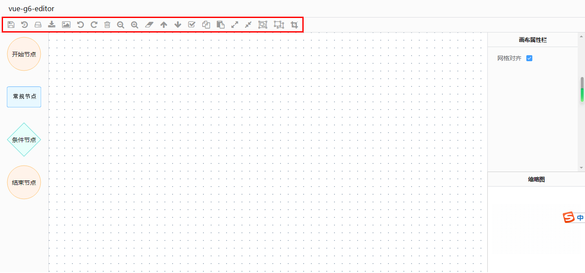
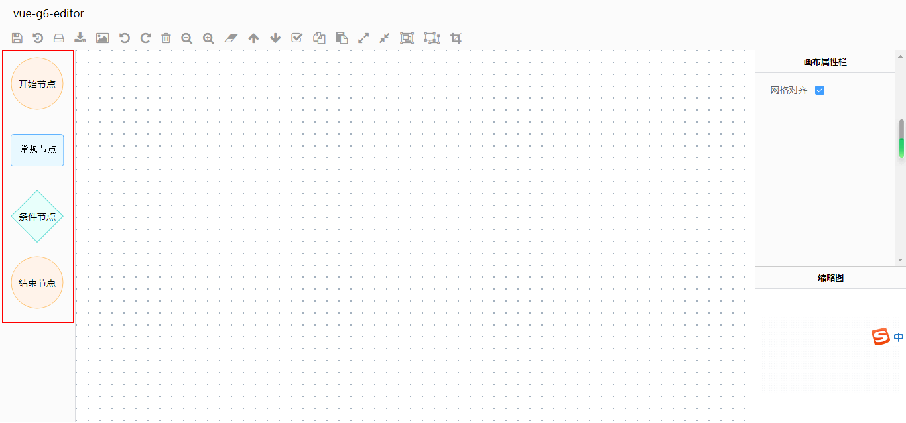
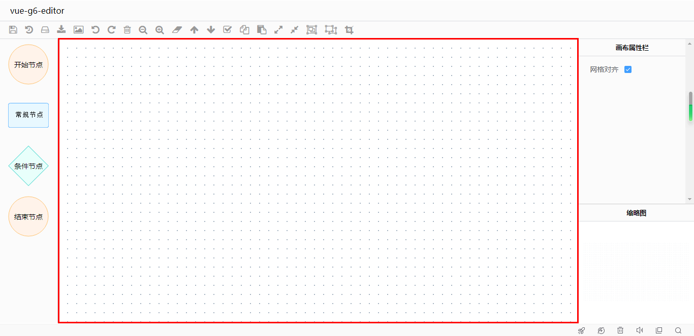

# 关闭体验改进计划打点请求

为了更好服务用户，G6Editor 会将 URL 和版本信息发送回 AntV 服务器，除了 URL 与 G6 版本信息外，不会收集任何其他信息。

如果不需要，可以通过以下代码关闭：

```javascript
G6Editor.track(false);
```


# Toolbar（工具栏）

## 效果

---



## 示例

在 UI 层面，HTML代码如下：

> 我使用的图标库是 font-awesome

```html
<div id="toolbar">
  <i data-command="save" class="command fa fa-floppy-o" title="保存"></i>
  <i data-command="undo" class="command fa fa-undo" title="撤销"></i>
  <i data-command="redo" class="command fa fa-repeat" title="重做"></i>
  <i data-command="delete" class="command fa fa-trash-o" title="删除"></i>
  <i data-command="zoomOut" class="command fa fa-search-minus" title="缩小"></i>
  <i data-command="zoomIn" class="command fa fa-search-plus" title="放大"></i>
  <i data-command="clear" class="command fa fa-eraser" title="清除画布"></i>
  <i data-command="toFront" class="command fa fa-arrow-up" title="提升层级"></i>
  <i data-command="toBack" class="command fa fa-arrow-down" title="下降层级"></i>
  <i data-command="selectAll" class="command fa fa-check-square-o" title="全选"></i>
  <i data-command="copy" class="command fa fa-files-o" title="复制"></i>
  <i data-command="paste" class="command fa fa-clipboard" title="粘贴"></i>
  <i data-command="autoZoom" class="command fa fa-expand" title="实际大小"></i>
  <i data-command="resetZoom" class="command fa fa-compress" title="适应页面"></i>
  <i data-command="addGroup" class="command fa fa-object-group" title="组合"></i>
  <i data-command="unGroup" class="command fa fa-object-ungroup" title="取消组合"></i>
  ....
</div>
```

在逻辑层面，JS代码如下：

```javascript
// 实例化 g6-editor 编辑器
const editor = new G6Editor();
// 实例化 toolbar 工具栏
const toolbar = new G6Editor.Toolbar({
    container: "toolbar"
});
editor.add(toolbar);
```

## 注意

1. 必须有 data-command 属性。
2. class 必须有 command 类名。
3. data-command 属性的值必须为有效命令。

# Itempannel（元素面板）

## 效果

------



------

## 示例

在 UI 层面，HTML代码如下：

```html
<div id="itempannel">
  <div
    class="getItem"
    data-type="node"
    data-shape="flow-rect"
    data-size="120*48"
    data-label="常规节点"
    data-color="#1890FF"
  >
    
  </div>
  <div
    class="getItem"
    data-type="node"
    data-shape="flow-circle"
    data-size="72*72"
    data-label="起止节点"
    data-color="#FA8C16"
  >
    
  </div>
  <div
    class="getItem"
    data-type="node"
    data-shape="flow-rhombus"
    data-size="80*72"
    data-label="分叉节点"
    data-color="#13C2C2"
  >
    
  </div>
  <div
    class="getItem"
    data-type="node"
    data-shape="flow-capsule"
    data-size="80*48"
    data-label="模型节点"
    data-color="#722ED1"
  >
    
  </div>
</div>
```

在逻辑层面，JS代码如下：

```javascript
// 实例化 g6-editor 编辑器
const editor = new G6Editor();
// 实例化 itempannel 工具栏
const itempannel = new G6Editor.Toolbar({
    container: "itempannel"
});
editor.add(itempannel);
```

## 注意

1. 官方文档提供了四种节点元素的图片，格式为SVG，因此如果希望自定义元素图片的话，也建议使用SVG格式。

   自定义SVG编辑器：http://www.zuohaotu.com/svg/

| 名称     | 地址                                                         |
| -------- | ------------------------------------------------------------ |
| 起止节点 | https://gw.alipayobjects.com/zos/rmsportal/ZnPxbVjKYADMYxkTQXRi.svg |
| 常规节点 | https://gw.alipayobjects.com/zos/rmsportal/wHcJakkCXDrUUlNkNzSy.svg |
| 分叉节点 | https://gw.alipayobjects.com/zos/rmsportal/SnWIktArriZRWdGCnGfK.svg |
| 模型节点 | https://gw.alipayobjects.com/zos/rmsportal/rQMUhHHSqwYsPwjXxcfP.svg |

2. 元素DOM的 class 类型必须为 getItem，否则无法将元素拖入画板。

3. 元素图片必须设置为禁止拖拽，否则拖拽到画板后，需要二次点击才会取消元素选中状态。

4. data-* 属性

   1. 所有 data-* 属性，除 data-type 以外，都会被添加进节点的数据模型。

      因为它是 g6-editor 设定的保留字段，决定了元素类型，如果你取值为 node，则拖出的是节点。

   2. data-size 的写法比较特殊，是长×宽的方式，详见以上示例，data-size 的大小决定了其被拖入画布后的大小。

5. 以上示例中 HTML 代码 和 data-* 属性，已是本人在保证语义化和无 bug 出现情况下的最精简版本，可直接复制使用，并在此基础上修改。

# Page（画布）

## 效果



## 示例

在 UI 层面，HTML 代码如下：

```html
<div id="page"></div>
```

在逻辑层面，JS 代码如下：

```javascript
// 因为是以流程图作为示例，因此实例化流程图Flow，其他图以此类推
const flow = new G6Editor.Flow({
    graph: {
        container: "page"
    }
});
```

## 更多配置项示例

```javascript
// 画布
const page = new G6Editor.Flow({
    graph: {
        container: "page"
    },
    align: {
        line: {
            // 对齐线颜色
            stroke: "#FA8C16",
            // 对齐线粗细
            lineWidth: 1
        },
        // 开启全方位对齐
        item: true,
        // 网格对齐
        grid: true
    },
    grid: {
        // 网孔尺寸
        cell: 18
    },
    shortcut: {
        // 开启自定义命令保存的快捷键
        save: true
    }
});
```


## 注意

1. （待定）画布DOM的 id 必须为 page，否则控制台会报错，原因不明，错误如下：

   

2. 必须在CSS中为画布设定高度


